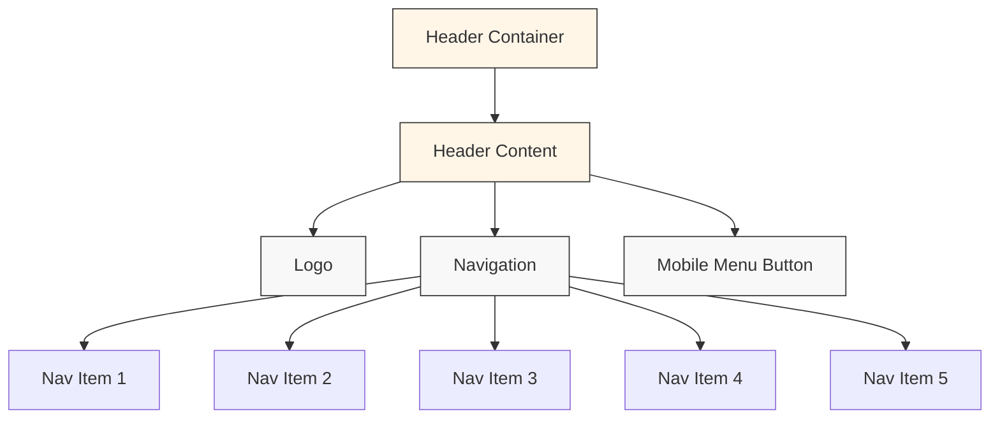
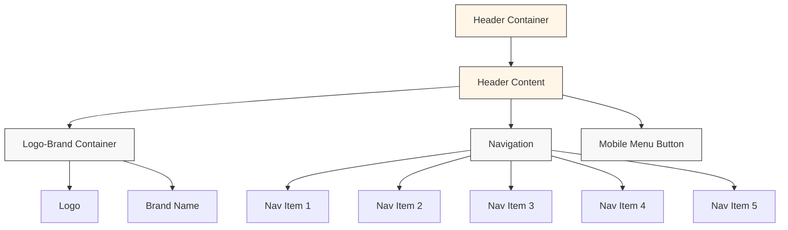
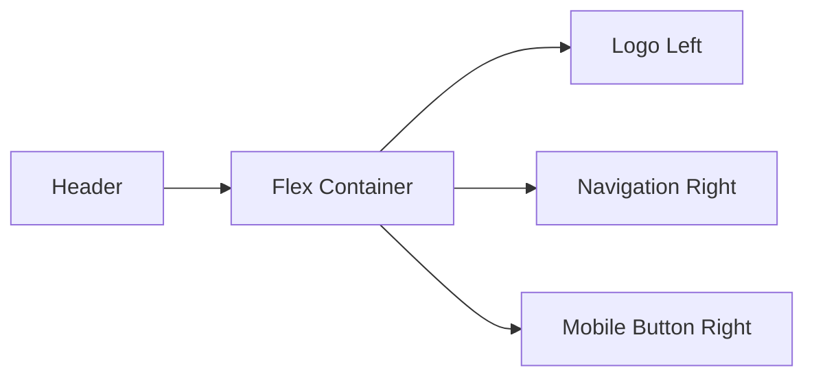
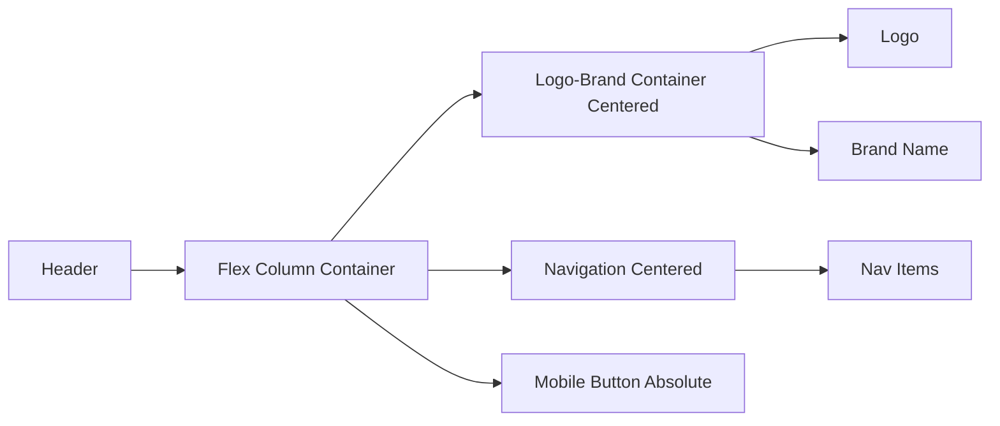
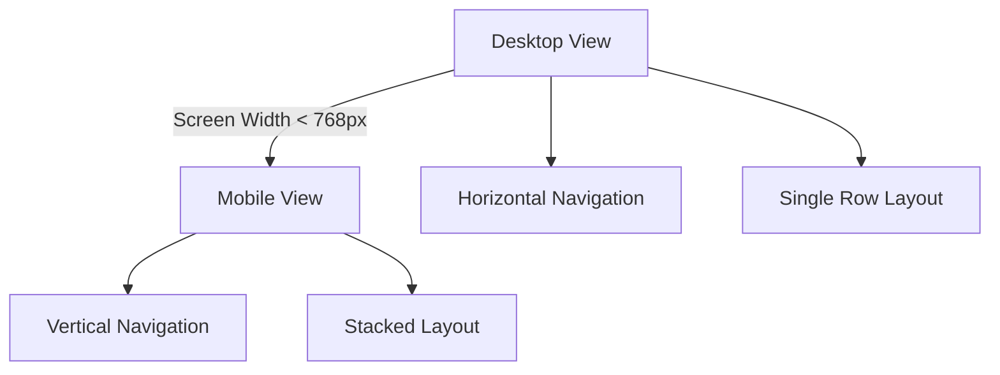
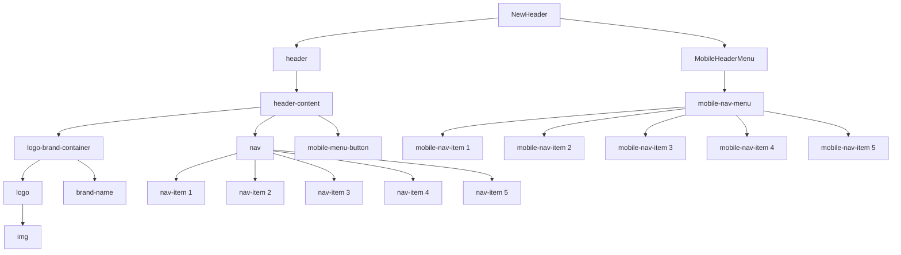

# Header Layout Visualization

## Current Header Layout

## Target Studio Abrash Header Layout (Desktop)

## Target Studio Abrash Header Layout (Mobile)

## Layout Flow Comparison

### Current Layout Flow

### Target Layout Flow

## Responsive Behavior

### Desktop to Mobile Transition

## Component Hierarchy

### New Header Component Structure

